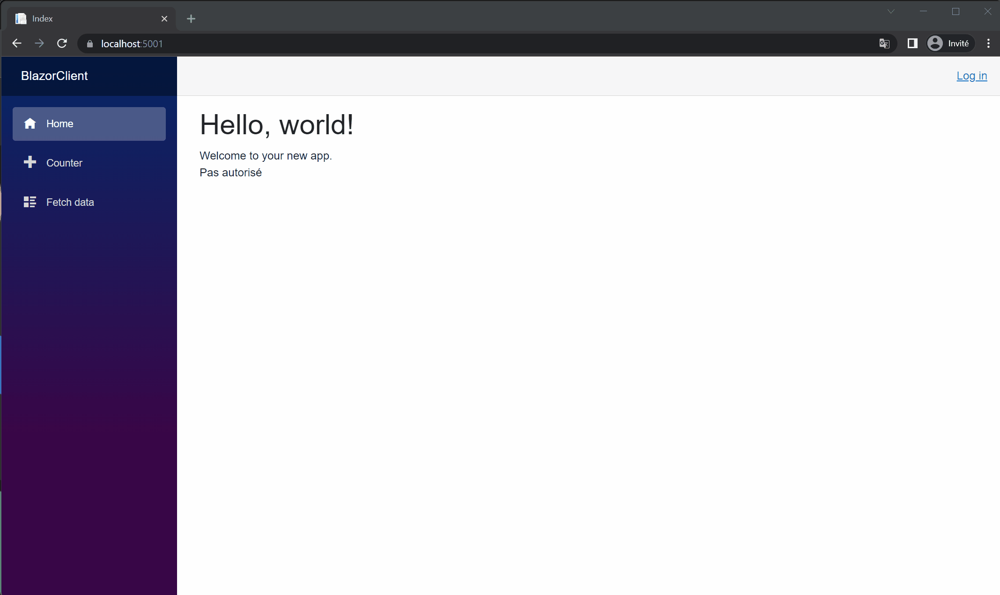

# SimpleJWTAuth

## Simple JWT

Implémentation d'autorisation par json web token 

Contient : 

Une api fournissant : 
* Une route permettant l'enregistrement d'un compte utilisateur
* Une route pour l'obtention d'un token + refresh token
* Une route permettant le rafraichissement du jeton

Une api crud de test nécessitant une autorisation et paramétrée avec l'api précédente comme emetteur de jwt

Les deux apis fournissent un swagger

### Données

Les données sont gérées avec entityframework qui utilise un connecteur pour mysql

Modifier la chaine de connexion et le connecteur en fonction du besoin

## Avec serveur d'identité

La solution comporte 3 projets : 

- Un serveur d'identité gère la partie authentification (openid) et autorisation (oauth2) utilisant la librairie openiddict.

- Une api demandant une validation de la part du serveur d'identité avec un scope

- Un front-end permettant la connexion d'un utilisateur donc le fournisseur d'identité est le serveur mentionné précédemment

Le scénario est le suivant : 

- L'utilisateur se connecte au front-end à l'aide du serveur d'identité et donne son consentement sur les scopes

- Le front-end appelle l'api en utilisant l'access-token récupéré.

- L'api valide le jeton en contactant le serveur d'identité et renvoie les données au front-end

Concernant l'autorisation de l'api, le front-end lors de la connexion, demande le consentement sur le scope correspondant à l'api (demo_api).

